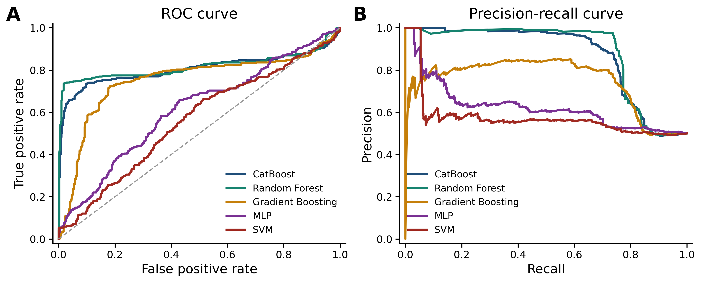

# Preterm birth prediction from EHG using EMD

[](LICENSE)
[](DATA_LICENSE.md)
[](https://www.python.org/)
[](https://doi.org/10.13026/C2166R)

Official research code and reproducibility materials for **“Preterm birth prediction from electrohysterography using empirical mode decomposition and interpretable machine learning.”**

This project evaluates whether empirical mode decomposition (EMD) improves record-level preterm birth prediction from electrohysterography (EHG). It uses the public Term–Preterm EHG Dataset with Tocogram (TPEHGT), leakage-safe grouped cross-validation, and interpretable handcrafted features.

> Research software only. This repository is not a medical device and its outputs must not be used for clinical diagnosis or patient care.

## Method overview

The main paper pipeline uses the dataset-provided filtered EHG channels (0.08–5.0 Hz):

```text
filtered EHG -> 3-minute or contraction segmentation -> EMD -> IMF1
             -> feature extraction -> grouped record-wise CV -> record prediction
```

The baseline extracts the same features directly from each filtered EHG segment without EMD. Cross-validation folds are stratified using one row per recording and then expanded to include all corresponding segments, preventing record-level leakage while preserving record-level class balance. Predictions are aggregated at recording level using the maximum segment probability. Peak-derived features that are undefined when a segment contains too few detected peaks are mean-imputed within each training fold.

## Main result

For fixed three-minute IMF1 features, the Random Forest achieved the strongest overall performance, averaged across 30 complete out-of-fold repetitions:

| Metric | Mean ± SD |
|---|---:|
| Accuracy | 0.8308 ± 0.0399 |
| F1-score | 0.7969 ± 0.0546 |
| Balanced accuracy | 0.8308 ± 0.0399 |
| Matthews correlation coefficient | 0.6998 ± 0.0714 |
| ROC-AUC | 0.8157 ± 0.0285 |
| Average Precision | 0.8877 ± 0.0333 |

These results are based on 26 recordings and require validation on larger independent cohorts. Running the analysis generates detailed metrics, predictions, and fold assignments under `outputs/results/`.



The curves pool all repeated out-of-fold recording scores for visualization. Their pooled metrics therefore differ slightly from the mean of the 30 repeat-level values reported in the table.

## Repository structure

```text
.
├── data/tpehgt/1.0.0/       # TPEHGT v1.0.0 (third-party data)
├── outputs/features/        # extracted feature tables
├── outputs/results/         # fold-, repeat-, and record-level results
├── config.py                # experiment settings and paths
├── io_readers.py            # WFDB loading and metadata parsing
├── features.py              # EMD and feature definitions
├── extract_features.py      # feature-extraction pipeline
├── classify_groupwise_cv.py # grouped repeated cross-validation
├── grouped_permutation_importance.py # grouped RF importance analysis
├── plot_signal_figures.py   # signal-processing figures
├── plot_performance_figures.py # performance figures
├── plot_feature_distributions.py # feature-distribution figure
├── README_PLOTS.md          # figure methods and reproduction details
└── run_all.ps1              # complete analysis and figure pipeline
```

## Installation

The reported experiments were executed using **Python 3.10.20**. 
The exact versions of the main software dependencies used for the reported results are pinned in `requirements.txt`.

```bash
git clone https://github.com/SenithJayakody/tpehgt-preterm-emd.git
cd tpehgt-preterm-emd
python -m venv .venv
```

Activate the environment:

```bash
# Linux/macOS
source .venv/bin/activate

# Windows PowerShell
.venv\Scripts\Activate.ps1
```

Then install the dependencies:

```bash
python -m pip install --upgrade pip
python -m pip install -r requirements.txt
```

## Reproduce the analysis

Run the complete analysis and figure pipeline from the repository root. The single runner contains portable Python commands and is invoked with Bash on Linux or macOS so that `-e` stops immediately if any stage fails:

```bash
bash -e run_all.ps1
```

Alternatively, run each stage directly:

```bash
python io_readers.py
python extract_features.py
python classify_groupwise_cv.py
python grouped_permutation_importance.py --n-repeats 30 --permutations-per-fold 1
python plot_signal_figures.py --record tpehgt_p001 --channel ehg2 --segment-id 0
python plot_performance_figures.py
python plot_feature_distributions.py
```

`extract_features.py` performs EMD for all configured segments and may take time. `classify_groupwise_cv.py` runs 30 repeats of five-fold grouped cross-validation for nine classifiers. The remaining stages calculate grouped permutation importance and generate the manuscript figures. Outputs are deterministic where supported, using the seed in `config.py`. See [`README_PLOTS.md`](README_PLOTS.md) for figure-specific methodology and options.

Both expensive stages use `N_JOBS` from `config.py` (`-1` uses all available
CPUs). Classification writes an atomic checkpoint after every complete
model/repeat job. Rerunning the same command automatically resumes compatible
checkpoints; use `--no-resume` only when a fresh computation is required.

For a short development check without changing the final defaults:

```bash
python classify_groupwise_cv.py \
  --n-repeats 1 \
  --experiments fixed_3min_imf1 \
  --models "Random Forest" "Logistic Regression" \
  --n-jobs 2
```

The complete manuscript analysis remains `N_REPEATS = 30`, `N_SPLITS = 5`
and is run without development arguments:

```bash
python classify_groupwise_cv.py
```

Core experiment parameters—including sampling rate, channels, segmentation, IMF selection, cross-validation, aggregation, and random seed—are documented in `config.py`. The committed README figure is regenerated by the complete runner; all other generated outputs remain ignored by Git.

## Data

This analysis uses **TPEHGT v1.0.0**, published by Franc Jager on PhysioNet:

- Dataset: <https://doi.org/10.13026/C2166R>
- Dataset page: <https://physionet.org/content/tpehgt/1.0.0/>
- License: Open Data Commons Attribution License 1.0 (ODC-By-1.0)

The analysis includes the 13 preterm and 13 term recordings; the five non-pregnant recordings are excluded. See [`DATA_LICENSE.md`](DATA_LICENSE.md) for attribution and licensing boundaries.

## Citation

If you use this code, please cite the associated paper. Until its final bibliographic details are available, use the repository’s GitHub **Cite this repository** control, powered by [`CITATION.cff`](CITATION.cff). Please also cite both the TPEHGT dataset paper and PhysioNet as requested on the dataset page.

```bibtex
@article{tilakarathna_preterm_emd,
  title   = {Preterm birth prediction from electrohysterography using empirical mode decomposition and interpretable machine learning},
  author  = {Tilakarathna, Umesha and Jayakody, Senith and Jayasooriya, Kalana and Godaliyadda, Roshan and Ekanayake, Parakrama and Nawinne, Isuru and Rathnayake, Chathura},
  note    = {Manuscript submitted for publication; software available at https://github.com/SenithJayakody/tpehgt-preterm-emd}
}
```

## License and contact

Original source code is released under the [MIT License](LICENSE). The dataset and included third-party article are not relicensed under MIT; their terms are described in [`DATA_LICENSE.md`](DATA_LICENSE.md).

Questions about the implementation can be sent to Senith Jayakody at [senith@eng.pdn.ac.lk](mailto:senith@eng.pdn.ac.lk).
